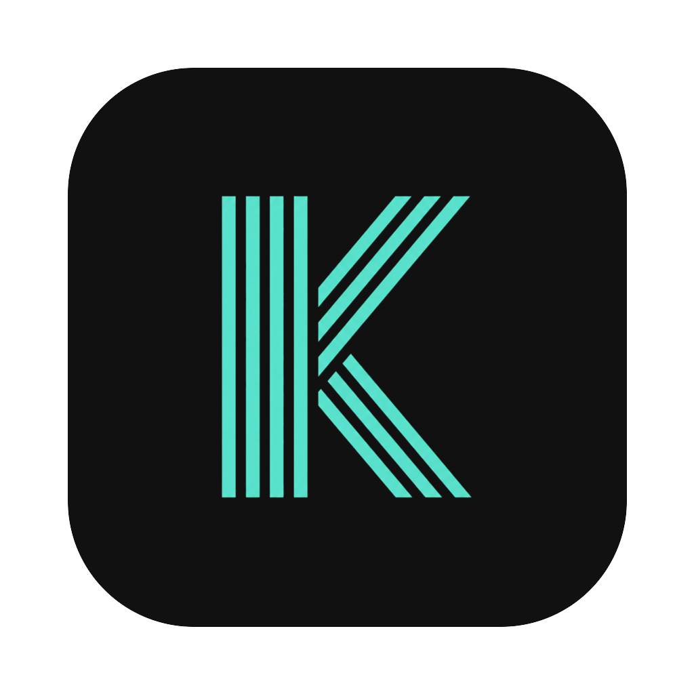

<div align="center">
  
  <h1>Koto</h1>
  <p>
    <strong>A quiet, AI-native desktop workspace</strong><br/>
    Notes · Collector · Terminal · Wiki · Memory — all wired into MCP so Claude, Codex and other agents can read &amp; write straight into your workspace.
  </p>
  <p>
    <a href="https://github.com/dxiongya/koto/releases/latest"></a>
    <a href="https://github.com/dxiongya/koto/actions/workflows/release.yml"></a>
    
    
  </p>
</div>

---

## Why Koto

Most "AI workspaces" are a chat window bolted onto a sidebar. Koto goes the other way: **the workspace itself is the surface AI agents act on.** Everything you do — collect a link, write a note, run a command in a terminal, build up a wiki — is exposed as a typed tool over the [Model Context Protocol](https://modelcontextprotocol.io). Pair Koto with Claude Desktop / Claude Code / Codex, and your agent can search your notes, ingest a tweet, write to a wiki page, or sync a collected article without you copying anything around.

The UI follows one principle: **content first, tools invisible.** Restrained dark theme, a single teal accent, monospace-leaning typography, animations that don't shout.

## Apps

| App           | What it is                                                       |
|---------------|------------------------------------------------------------------|
| **Notes**     | Rich-text markdown editor (Lexical) with inline AI writing, hashtag/code/table/callout/image-resize/video nodes, table of contents, multiple themes (`Default`, `Editorial`, `GitHub`, `Serif`, `Compact`) |
| **Collector** | Links, images, tweets, screenshots, text snippets. Auto-fetched markdown (Jina Reader), Gemini OCR for images, hybrid keyword + semantic search, masonry layout, drag straight into other apps **or** out to Finder/Photoshop |
| **Terminal**  | xterm.js with WebGL, multi-tab, persistent scrollback buffers, per-workspace cwd, drag sessions across panes |
| **Wiki**      | Auto-built knowledge base. Force-directed graph, [[wikilink]] resolution, confidence scoring, supersession, self-healing lint |
| **Memory**    | Where AI quietly remembers what matters. Temporal knowledge graph (entities + relations) curated by an embedded agent |

## MCP — 28 tools out of the box

Koto runs a built-in MCP server on `127.0.0.1:3899` that exposes Bus capabilities from every app:

| Namespace    | Tools |
|--------------|-------|
| `notes.*`    | `search`, `read`, `write`, `create`, `listFiles`, `setMarkdownTheme` |
| `collector.*`| `search`, `list`, `getMarkdown`, `add`, `groups`, `addGroup`, `update`, `renameGroup`, `syncGroup` |
| `wiki.*`     | `status`, `listPages`, `read`, `write`, `appendLog`, `ingestNow`, `setAutoIngest` |
| `terminal.*` | `search` |
| `task.*`     | `list`, `create`, `update`, `delete`, `trigger` |

Both **Streamable HTTP** (`/mcp`) and **SSE** (`/sse`) transports are served.

### One-shot install for your agent

```bash
# Claude Code (native HTTP transport)
claude mcp add --transport http koto http://localhost:3899/mcp --scope user

# Codex CLI
codex mcp add koto --url http://localhost:3899/mcp

# Claude Desktop (via mcp-remote stdio proxy)
# Add to ~/Library/Application Support/Claude/claude_desktop_config.json:
# "koto": { "command": "npx", "args": ["-y", "mcp-remote", "http://localhost:3899/mcp"] }
```

Then right-click any note in the sidebar → **Copy reference (for AI)** to grab its path, and tell your agent: *"write this draft to `goduck/inner.md`"* — `notes.write` does the rest.

## Workspace mechanics

- **VSCode-style tabs + splits** — drag any item into any pane, split horizontally or vertically, route notes/terminals/collector items into the same surface
- **Per-tab color picker** — right-click a tab → 8 palette swatches + reset. Color persists per resource, follows the file/terminal into every pane it's opened in
- **Per-app icon hue** — notes (teal), collector (amber), terminal (indigo), wiki (violet), memory (pink) — picked for max chromatic separation at small icon sizes
- **Cross-app drag** — collector item → terminal (injects path), terminal session → notes (creates wikilink), notes → wiki, etc.
- **Cmd+P palette** — fuzzy file search across notes/code, with prefixes for `>` commands, `#` content search, `n / c / t` to scope to Notes / Collector / Terminal, `:` to jump to line
- **Cmd+Shift+K** — copy resource path always; **inject into terminal** when terminal is the focused surface

## Install

### From a release

Download the latest **`koto-x.y.z.dmg`** from [Releases](https://github.com/dxiongya/koto/releases/latest), drag Koto.app into Applications.

> CI builds are ad-hoc signed. First launch: right-click the app → **Open** → **Open** again in the Gatekeeper prompt. Or strip the quarantine bit:
> ```bash
> xattr -dr com.apple.quarantine /Applications/Koto.app
> ```

### From source

```bash
git clone git@github.com:dxiongya/koto.git
cd koto
pnpm install         # postinstall rebuilds native modules for Electron
pnpm dev             # live-reload dev shell
pnpm build:mac       # signed .dmg + .zip into dist/
```

## Tech stack

- **Electron 39** · **React 19** · **TypeScript** · **Vite 7** (via [electron-vite 5](https://electron-vite.org))
- **Tailwind CSS 4** with CSS custom-property themes
- **Lexical** (notes) · **CodeMirror 6** (code) · **xterm.js + WebGL** (terminal)
- **better-sqlite3** for collector / wiki / memory storage · **graphology + sigma** for the wiki graph
- **Gemini Embedding 2** for semantic search · **node-pty** for shells
- Built-in **MCP server** (`@modelcontextprotocol/sdk`)

## Architecture

```
electron main ─┬─ collector store (sqlite + fts5 + vectors)
               ├─ wiki store     (sqlite + fts5 + vectors)
               ├─ memory store   (temporal knowledge graph)
               ├─ pty manager    (node-pty sessions)
               ├─ MCP server     (port 3899, exposes Bus capabilities)
               └─ IPC bridge ────────────────┐
                                             ▼
                                       renderer (React)
                                       ├─ apps/  (notes, collector, terminal, wiki, memory)
                                       ├─ AppRegistry + Bus (capability provider/consumer)
                                       └─ Pane tree (VSCode-style tabs + splits)
```

Apps are registered via `AppDefinition`s. Each app calls `api.bus.provideTool(...)` to expose typed capabilities — those auto-bridge to the MCP server and become tools any agent can call.

## Roadmap

- Inspector panel in terminal: clickable file paths → CodeMirror viewer, `git status / diff / log` inline
- Notion-style nested page references in notes
- Per-pane terminal scrollback persistence across hard restarts
- Real Apple Developer signing in CI

## Design context

Koto is for knowledge workers who need to think, search, write, and ship without context-switching between five apps. Built to feel like a single quiet surface — not a parade of features.

Brand personality: **优雅 · 沉浸 · 高效** (elegant · immersive · efficient).<br/>
Reference *anti*-patterns: VS Code (too dense), Evernote (bloated), ChatGPT (AI shouldn't be a chat window).

## License

Not yet finalized. Source is public for now; reach out if you want to use it commercially.

---

<sub>Built with care by [@dxiongya](https://github.com/dxiongya).</sub>
